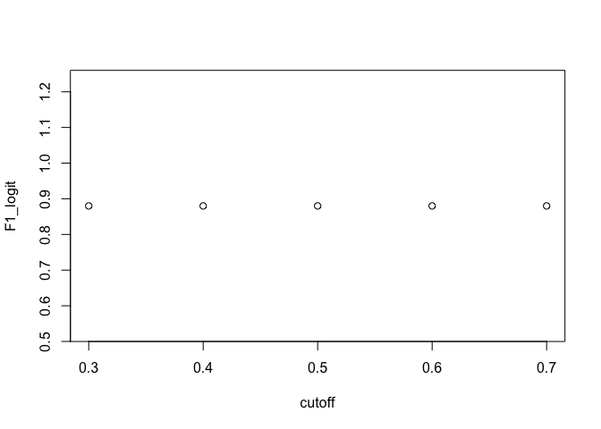
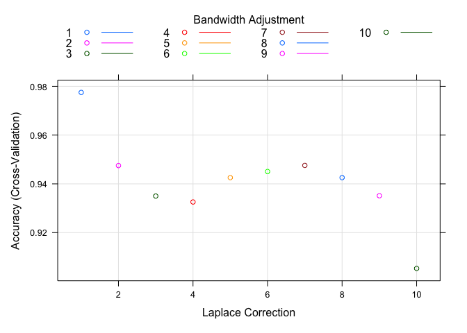

Final Project
================
Carrie Cheng
2022-12-10

# Introduction

Higher accuracy in disease prediction would largely help patients and
doctors. However, modern day data sets are usually complex, and the
traditional statistical models for prediction might not be enough.
Therefore, in this project, we aim to analyze whether machine learning
algorithms would outperform the traditional logistic regression in a
classification problem under the context of predicting disease. We will
look at the chronic kidney disease data set from the UCI machine
learning repository, and investigate which model out of the traditional
statistical model and machine learning models could best classify the
development of chronic kidney disease.

The data set has 25 variables. One of these variables is the binary
outcome variable recording whether the patient develops the kidney
disease. The rest of the variables record the clinical information of
the patients such as age, blood pressure, specific gravity, albumin,
sugar, red blood cells, pus cell and bacteria. The data set contains
both quantitative variables such as age, blood pressure, and sodium, and
qualitative data such as albumin, sugar, hypertension. The data has
missing values. To deal with the missing values, we impute the missing
values with the mean of each variable excluding the missing values for
quantitative variables, and the lowest or reference category for
categorical variables.

<!-- -->

From the plot, we see that age and the outcome might have a nonlinear
relationship. Therefore, we calculate the pearson correlation to see the
strength of linear relationship between each variable and the outcome.

    ##       pearson correlation with outcome     p values
    ## age                         0.21787598 1.098513e-05
    ## bp                          0.29136656 2.877686e-09
    ## sg                         -0.65970612 0.000000e+00
    ## al                          0.52337662 0.000000e+00
    ## su                          0.26625071 6.436108e-08
    ## rbc                         0.28870505 4.059777e-09
    ## pc                          0.35700856 1.814104e-13
    ## pcc                         0.23748477 1.557398e-06
    ## ba                          0.19087904 1.225307e-04
    ## bgr                         0.39005523 4.440892e-16
    ## bu                          0.37981834 3.552714e-15
    ## sc                          0.29697131 1.377874e-09
    ## sod                        -0.33828027 3.642864e-12
    ## pot                         0.07699492 1.242047e-01
    ## hemo                       -0.72217253 0.000000e+00
    ## pcv                        -0.68935489 0.000000e+00
    ## wbcc                        0.21059989 2.171006e-05
    ## rbcc                       -0.58231038 0.000000e+00
    ## htn                         0.57113322 0.000000e+00
    ## dm                          0.52126341 0.000000e+00
    ## cad                         0.24115247 1.059976e-06
    ## appet                      -0.35747752 1.678657e-13
    ## pe                          0.37010498 1.976197e-14
    ## ane                         0.31798693 7.537082e-11
    ## class                       1.00000000           NA

From the table, we see that the absolute values of the pearson
correlation mostly do not exceed 0.5, which means that most of the
variables appear to have a weak linear correlation with the outcome.
However, we see that their corresponding p values are small, which
indicates that the variables are associated with the outcome. Therefore,
we need to consider flexible models which could capture complex and
nonlinear relationship between predictors and the outcome. In
particular, we will consider random forests, naive bayes, decision tree,
and k-nearest neighbors.

# Results

In order to investigate whether machine learning algorithms could
capture more complex relationships between predictors and outcome, we
will apply flexible models including classification trees, random
forests, k-nearest neighbors, and naive bayes. First, we will train each
algorithm with fixed parameters using only one train and test set for a
reference purpose. We will also train a logistic regression in order to
establish a comparison on the performance between the traditional
statistical methods and the machine learning algorithms. For random
forests, we set the number of trees trained to be 100, and for k-nearest
neighbors, we set the number of neighborhood to be 5.

    ##               Accuracy Sensitivity Specificity
    ## metric_logit 0.9008264   0.9361702   0.8783784
    ## metric_rf    0.9752066   0.9361702   1.0000000
    ## metric_tree  0.9586777   0.9148936   0.9864865
    ## metric_nb    0.9090909   0.9574468   0.8783784
    ## metric_knn   0.6942149   0.8510638   0.5945946

From the table, random forests and classification trees have higher
accuracy than logistic regression, but naive bayes and k-nearest
neighbors have lower accuracy than logistic regression even though the
accuracy of naive bayes is close to that of logistic regression.
However, we see that in terms of sensitivity, naive bayes has the
highest value, followed by logistic regression and random forest, then
classification trees and k-nearest neighbors. In terms of specificity,
classification trees have the highest value, followed by logistic
regression and random forests, then naive bayes and k-nearest neighbors.
In general, the specificity is higher than the sensitivity rate for the
three out of five algorithms.

Now, let’s look at their F1 score against different cut-off thresholds
for each algorithm.
<!-- -->

We see that for logistic regression, different cut-offs do not generally
influence the F1 score.

<!-- -->

For random forests, different cut-off values do make a difference on the
F1 score. Specifically, the cut-off value of 0.4 achieves the highest F1
score for random forests. This situation is likely due to that random
forests apply bootstrapping strategy, which is very likely to result in
variability among individual trees and their predictions and results.

<!-- -->

We see that for classification trees, different cut-offs do not
generally influence the F1 score.

<!-- -->

We see that for naive bayes, different cut-offs do not generally
influence the F1 score.

<!-- -->

For k-nearest neighbors, we see there is a sudden jump from cut-off
value of 0.3 to cut-off value of 0.4. This might indicate that the
averages taken in different neighbors for this data set have a large
variation so that setting the cut-off to 0.3 will make a difference in
prediction. In general, logistic regression, classification trees,
random forests, and naive bayes all have similar F1 scores, and
k-nearest neighbors have the lowest F1 score.

Nevertheless, these results are only based on a single cross-validation
set with fixed parameters. However, the performance of these algorithms
might differ with different parameters. Therefore, we will implement a
common practice of parameter tuning using a 10-fold cross-validation and
record the best tuned model using a 10-fold cross-validation. Since
there is no tuning parameter for logistic regression, we will only train
the model with a 10-fold cross-validation.

For random forests, we will tune the number of trees trained first. We
will train a random forests model for 10 different numbers of trees with
a 10-fold cross-validation and we keep the number of variables randomly
selected for placing splits as three.

<!-- -->

From the graph, we see that the accuracy is greatly boosted from
training only one tree to 101 trees, and the accuracy stays
approximately the same for even larger number of trees trained. Having a
large number of trees trained helps the accuracy of prediction.

Next, we will also look at the influence of number of variables randomly
selected as predictors on the accuracy of prediction. In this tuning
process, we trained random forests for 8 different number of variables
randomly selected as predictors with a 10-fold cross-validation and plot
them against the accuracy.

<!-- -->

From the plot, we see that having three randomly selected predictors has
the highest accuracy. However, the accuracy across different number of
randomly selected predictors do not vary much and are generally close to
each other. With contrast to number of trees trained, the accuracy of
prediction is more sensitive to a small change in the number of randomly
selected predictors.

Next, we will tune the classification tree using the complexity
parameter ranging from 0 to 0.1 with a 10-fold cross-validation and plot
them against the accuracy.

<!-- -->

From the graph, we see that the highest accuracy occurs when the
complexity parameter is 0.02. The accuracy generally decreases as
complexity parameter becomes larger. A larger complexity parameter will
generally result in a smaller number of nodes. This explains the general
decreasing pattern in accuracy with complexity parameter increasing.

Now, we will tune the number of neighbors for k-nearest neighbors with a
10-fold cross-validation and plot them against the accuracy.

<!-- -->

From the graph, we see that the highest accuracy occurs for one number
of neighbor. This might be due to that the predictors in the data set
have a wide and varying range. We also see that the overall accuracy of
k-nearest neighbor is low even though the accuracy is higher when number
of neighbor is one.

We will tune the bandwidth or flexibility of the kernel density and the
laplace smoothing correction for naive bayes using a 10-fold
cross-validation and plot them against the accuracy.

<!-- -->

From the graph, we see that the accuracy is highest when bandwidth
adjustment and laplace correction both equal to 1.

Finally, we train a logistic regression with a 10-fold cross-validation
since there is no tuning parameter for logistic regression.

Now, let’s compare the best tuned models.

    ##                Accuracy
    ## random forest 0.9749969
    ## tree          0.9300360
    ## knn           0.7725907
    ## naive bayes   0.9774969
    ## logit         0.9301032

From the table, we see that the best tuned model for random forests has
the highest accuracy, followed by naive bayes. Classification tree and
logistic regression have similar accuracy performance, and the k-nearest
neighbors have the lowest accuracy. Comparing to the performance of each
algorithm with fixed algorithm, we see that random forests, naive bayes,
and k-nearest neighbors have improved performance. However, even though
k-nearest neighbors increases accuracy by parameter tuning, it is still
the lowest in terms of accuracy and underperforms logistic regression.

# Conclusion

In this project, we aim to compare the performance of nonparametric
machine learning algorithms and parametric logistic regression under a
classification problem for predicting diseases and try to determine
which machine learning model performs the best. In particular, we used
random forests, classification tree, k-nearest neighbors, and naive
bayes to compare with the logistic regression. In general, we see that
parameter tuning helps improve the performance of most of machine
learning algorithms. After tuning the parameter, most machine learning
algorithms except the k-nearest neighbors performs at least as good as
the logistic regression. Therefore, the nonparametric approaches using
machine learning algorithms outperform the logistic regression for
classifying the kidney disease in this data set, and the best predictive
model in terms of accuracy is random forests.

Therefore, the analysis in this project was successful as we see that
there was an improvement in accuracy in predicting the kidney disease
using machine learning algorithms implemented in this project except
k-nearest neighbors. However, because of the limitation of time, one
should also consider the variance of the performance metrics including
accuracy, sensitivity, and specificity by repeatedly splitting the data
into test and train set and look at the variation among the performance
metrics calculated for each data splitting. Another limitation of this
project is that the project only considered the performance metrics of
the machine learning algorithms, but did not analyze the time that each
machine learning algorithm took to perform the training and prediction
and compare it with time taken for training logistic regression.

# Reference

UCI Machine Learning Repository: Chronic_kidney_disease Data Set,
<https://archive.ics.uci.edu/ml/datasets/Chronic_Kidney_Disease>.

Dua, D. and Graff, C. (2019). UCI Machine Learning Repository
\[<http://archive.ics.uci.edu/ml>\]. Irvine, CA: University of
California, School of Information and Computer Science.

Irizarry, Rafael A. Introduction to Data Science: Data Analysis and
Prediction Algorithms with R. CRC, 2020.
